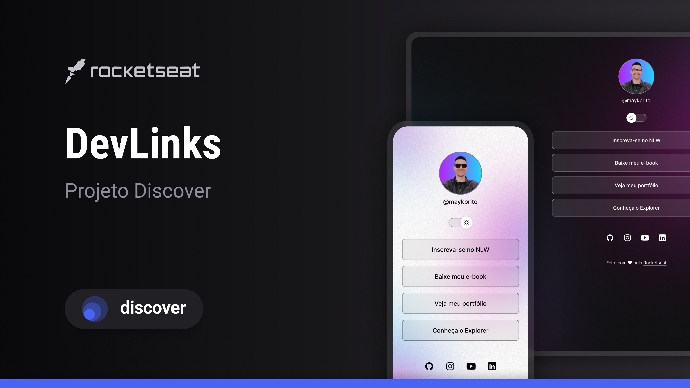

<h1 align="center"> DISCOVER DEVLINKS </h1>

  

 

  

## 🚀 Tecnologias

Esse projeto foi desenvolvido com as seguintes tecnologias:

- HTML e CSS
- JavaScript
- Git e Github
- Figma

## 💻 Projeto

O projeto utilizado para iniciantes no desenvolvimento web chamado discover da Rcketseat.

## 🔖 Layout

Você pode visualizar o layout do projeto através [DESSE LINK](<https://www.figma.com/file/yxBPuAQmPyyYz1gvVc4QKw/DevLinks-%E2%80%A2-Projeto-Discover-(Community)?type=design&node-id=1437-345&mode=design&t=fB1CP9W7gmiIledb-0>). É necessário ter conta no [Figma](https://figma.com) para acessá-lo.

## :memo: Licença

Esse projeto está sob a licença MIT.

---

Feito com ♥ by Rocketseat :wave: [Participe da nossa comunidade!](https://discord.gg/rocketseat)
